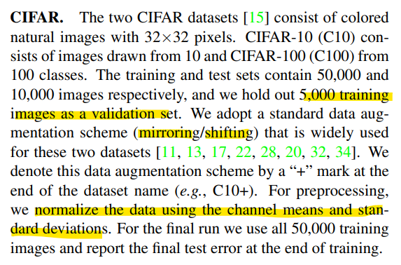
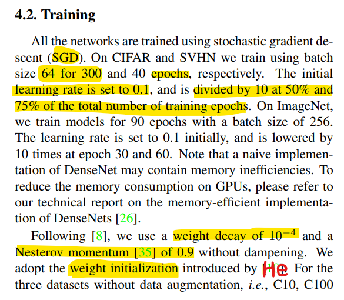
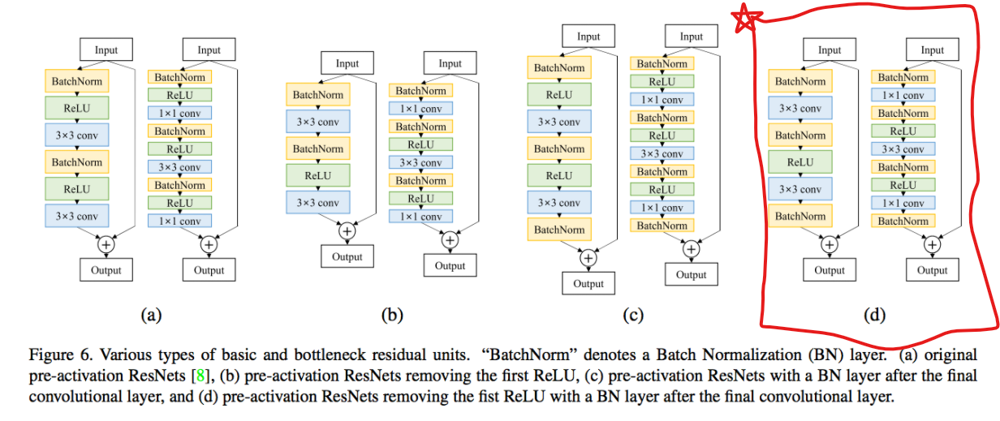

# 2021-2 CAPSTONE
Capstone Design Project in 2021 2nd Semester
# 주의사항

- 개인 GPU에서 수행하고 .ipynb  파일로 제출해도, colab에서 검증될 수 있도록 주의
    - random seed 설정 필수!
    - colab 라이브러리 import도 추가해야할듯.
        - from google.colab import drive
        - drive.mount('/content/gdrive')
- 조교 office hour 예정. (1~2번)
- 질문 사항 → 게시판 or E-mail

# 계획

|**이름**|**날짜**|**비고**|
|:---:|:---:|:---:|
|Baseline 코드 탐색|2021년 10월 26일 → 2021년 11월 1일||
|제안서 제출|2021년 11월 5일 오전 9:00||
|최종 발표|2021년 12월 13일|**Online in English**|
|최종 보고서 제출|2021년 12월 20일 오전 9:00|**Korean or English**|

# Image Classification

- Accuracy - 40%
- 신규성 - 30%
    - 제공된 Baseline 외에 추가로 시도한 것들
    - 성능 개선
    - Data Augmentation, Hyperparameter, Overfitting 방지 등 시도 가능
- 이론적 근거 - 20%
    - 어떤 이유에서 잘 되는지.
    - Backbone 학습 안됨. **CIFAR10 데이터셋**만 활용할것.
- 보고서 완성도 - 10%

- 모델 구현 계획
    - ResNet152
    - WideResNet
    - DenseNet
    - PyramidNet        
        
- Training 기법

    - Data augmentation : mirroring / shifting
    - Normalize : channel means & standard deviation
    - Optimizer : SGD, weight decay : 1e-4, momentum : 0.9
    - Batch size : 64
    - Epoch : 300
    - Learning rate : 0.1
    - LR Scheduler
        - 150 epoch - 0.01
        - 225 epoch - 0.001
    - Weight Initialization : He

- Block Architecture
    - Bottleneck layer
        - BN-ReLU-1x1Conv(4k)-BN-ReLU-3x3Conv(k)
    - Compression
        - θ =0.5
    - **Implementation Detail**
        - 3 Dense blocks, equal number of layers
        - Before first dense block,

---
# CIFAR Dataset Explanation

# DenseNet Training Condition

        
# PyramidNet Block Architecture

        
    
# References

1. 코드 전체적인 틀
    
    [https://tutorials.pytorch.kr/beginner/basics/quickstart_tutorial.html](https://tutorials.pytorch.kr/beginner/basics/quickstart_tutorial.html)
2. CIFAR10 분석 블로그
    
    [https://dnddnjs.github.io/category/cifar10/](https://dnddnjs.github.io/category/cifar10/)
        
# 발표 날짜 - 16주차 월요일 (12/13 (월))

- On-Line
- Presentation in English
- 최종 보고서는 한글, 영어 둘 다 가능 (영어 가점은 없음)
- 발표 : 12/13 수업시간, 최종보고서 : 12/20 09:00
